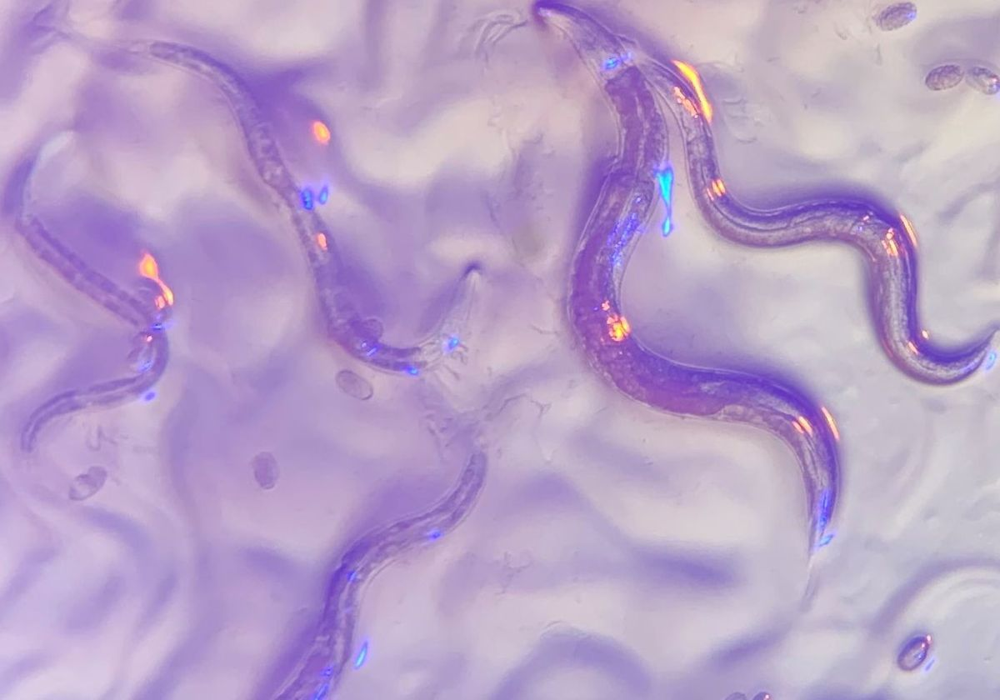
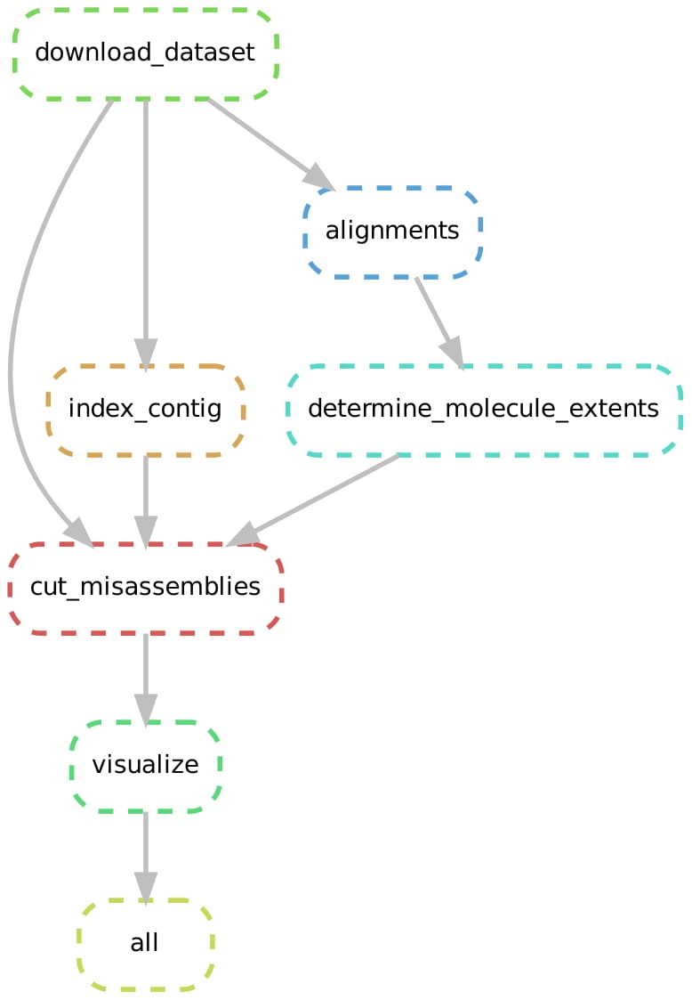

# Biof501 Term Project: Misassembly Detection Using Linked Reads from Large Molecules 
:computer: :dna:

## By: Armaghan Sarvar

### Background and Rationale

Generating high-quality de novo genome assemblies is foundational to the genomics study of organisms  [[1](#references)]. Genome sequencing yields the sequence of short snippets of DNA, i.e. reads, from a genome. Genome assembly attempts to reconstruct the original genome from which these reads were obtained. This task is difficult because of the possible errors and gaps in the sequencing data, and repetitive sequence in the underlying genome. As a result, assembly errors are common. Misassemblies not only complicate downstream analyses, but also limit the contiguity of the genome assembly. <br>
**Tigmint** is a tool that makes use of the long distance information of the large molecules provided by special reads called **Linked-Reads**, in order to detect misassemblies in the absence of a reference genome [[2](#references)]. Once identified, these misassemblies may be corrected, improving the quality of the assembled sequence. <br>
Linked-reads, a sequencing technology developed by 10x Genomics, leverages microfluidics to partition and barcode HMW DNA to generate a data type that provides contextual information of the genome from short-reads. Simply put, linked-reads provide long-range information from short-read sequencing data.
<br>
Tigmint identifies misassembled regions of an input assembly by inspecting the alignment of linked reads to the draft genome assembly. More specifically, it groups linked-reads with the same barcode into molecules. Next, it identifies regions of the assembly that are not well supported by the linked reads, and cuts the contigs of the draft assembly at these positions.
<br>
#### Purpose
The purpose of this pipeline is to use the workflow presented in the Tigmint paper to detect misassemblies of an assembled contig, and visualize the separated sequences at the cut locations.

### Dataset


The dataset used in this project is Caenorhabditis elegans (known as C. elegans) simulated linked reads, generated using LRSim [[3](#references)] by the authors of the Tigmint paper. 
To elaborate more upon the dataset, C. elegans is a non-infectious, non-pathogenic, non-parasitic organism.  It is small, growing to about 1 mm in length, and lives in the soil in many parts of the world, where it survives by feeding on microbes such as bacteria.
Currently, an international consortium of laboratories are collaborating on a project to sequence the entire 100,000,000 bases of DNA of the C. elegans genome. The development and function of this organism is encoded by an estimated 17,800 distinct genes.
<br>
But why invest so much effort into studying this small organism?
<br>
Despite its apparent simplicity, C. elegans is an organism that shares many of the essential biological characteristics that are central problems of human biology [[4](#references)]. For example, it is conceived as a single cell which undergoes development, starting with embryonic cleavage, proceeding through morphogenesis and growth to the adult. It has a nervous system, and it exhibits behavior and is even capable of rudimentary learning. Hence, C. elegans provides researchers with the ideal compromise between complexity and tractability.


### Workflow Visualization 
A figure depicting the steps of the workflow is shown below. 

<p align="center">

</p>

The above workflow is broken down into the following major steps: <br>
1. Download and prepare the dataset.
2. Index the draft genome assembly with `samtools`.
3. Align the linked-reads to the draft genome assembly using `BWA-MEM`.
4. Call the `tigmint-molecule` shell commad to determine the extent of the molecules based on the alignment data.
5. Call the `tigmint-cut` shell commad to detect misassembly locations and cut the draft assembly.
6. Visualize the separated contig segments.

### Usage

#### Dependencies
The main package dependencies for this pipeline are:
```
Python v3.6.10
snakemake v3.13.3
Tigmint v1.2.2
bwa v0.7.17
samtools v1.9
matplotlib v3.2.2
Mac/Unix OS
```
#### Installation
1. First, you can clone this repository by running the following command:

```
git clone https://github.com/ArmaghanSarvar/BIOF501-Project.git
```
2. Now, you can navigate to the project directory:
```
cd BIOF501-Project
```
3. You can use a `conda` environment to run the workflow. Create the conda environment using the following command:
```
conda env create --name tigmint_env --file environment.yml
```
4. Activate the environment using the following command:
```
conda activate tigmint_env
```
5. You can now run snakemake by executing the following code. The number of cores can be specified using the `--cores` argument.
```
snakemake --cores 4
```

#### Input Files
The input should be a set of Linked-Reads (single fastq file) and an assembled contig (fasta file). You can define the location of the input files in `config.yaml`. If the files are hosted remotely, the download link should be provided in `config.yaml`. We also support automatical decompression for files that are compressed in the gzip format.

#### Intermediate Files
The pipeline create some intermediate files in the directory of the dataset, and the "data" directory. These files are created using `bwa`, `samtools`, and `tigmint` tools, and include the index for the assembled contig, the alignments, and the molecule extents.

#### Output Files
The output of the pipeline is as follows:
* The separated molecule extents of the original assembled contig stored as *"output/separated_contigs.fa.bed"*
* The cut assembled contig as a FastA file stores as *"output/separated_contigs.fa"*
* The visualization of the molecule extents stored as *"output/separated_molecules.png"*

### Results
The pipeline has been tested on an assembled contig of C. elegance. The input data is available in the dataset folder under the following names:
* celegans-contig.fa
* celegans-linkedreads.fq

The chosen configuration is as follows. 
```
spanning_molecule_threshold: 50
window_size: 1000
minimum_molecule_size: 2000
trim: 0
```
The output is available in the *expected_output* directory under the following names:
* celegans_separated_contigs.fa
* celegans_separated_contigs.fa.bed
* celegans_separated_molecules.png

The output files indicate that the original contig was misassembled at 5 different locations. Each separate segment is demonstrated using a different color.

To show the pipeline working on a remote dataset as well, we are providing the results for a synthetic dataset from Tigmint's GitHub repository. Modify `config.yaml` using the following configurations to download the data.

```
contig_download_link: "https://raw.githubusercontent.com/bcgsc/tigmint/master/tests/test_contig.fa"
linked_reads_download_link: "https://raw.githubusercontent.com/bcgsc/tigmint/master/tests/test_linkedreads.fq.gz"
zipped_contig: False
zipped_linked_reads: True
```
After running `snakemake`, you can verify your results by comparing them to the following files in the *expected_output* directory:
* synthetic_separated_contigs.fa
* synthetic_separated_contigs.fa.bed
* synthetic_separated_molecules.png

As it can be seen from the image, the synthetic file cuts the original contig in two locations, resulting in three separate segments.


### References
[1] Coombe, Lauren, et al. "LongStitch: High-quality genome assembly correction and scaffolding using long reads." bioRxiv (2021).

[2] Jackman, Shaun D., et al. "Tigmint: correcting assembly errors using linked reads from large molecules." BMC bioinformatics 19.1 (2018): 1-10.

[3] Luo, Ruibang, et al. "LRSim: a linked-reads simulator generating insights for better genome partitioning." Computational and structural biotechnology journal 15 (2017): 478-484.

[4] Kaletta, Titus, and Michael O. Hengartner. "Finding function in novel targets: C. elegans as a model organism." Nature reviews Drug discovery 5.5 (2006): 387-399. 
